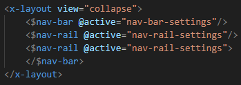
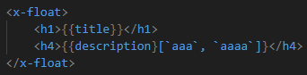

# display README

> Base: [https://github.com/microsoft/vscode/blob/main/extensions/xml/]

This is the README for the "DISPLAY XML" extension. This library only adds some extra syntax highlighting for ".display" files.

## Features

- Syntax highlighting for local components:

- Syntax highlighting for locale language expressions:

## Requirements

*None...*

## Extension Settings

*None...*

## Known Issues

*None...*

## Release Notes

Users appreciate release notes as you update your extension.

### 0.0.1 - 0.0.2

The initial release of Display XML extension.

### 0.0.3

Update VSCode engine version.
